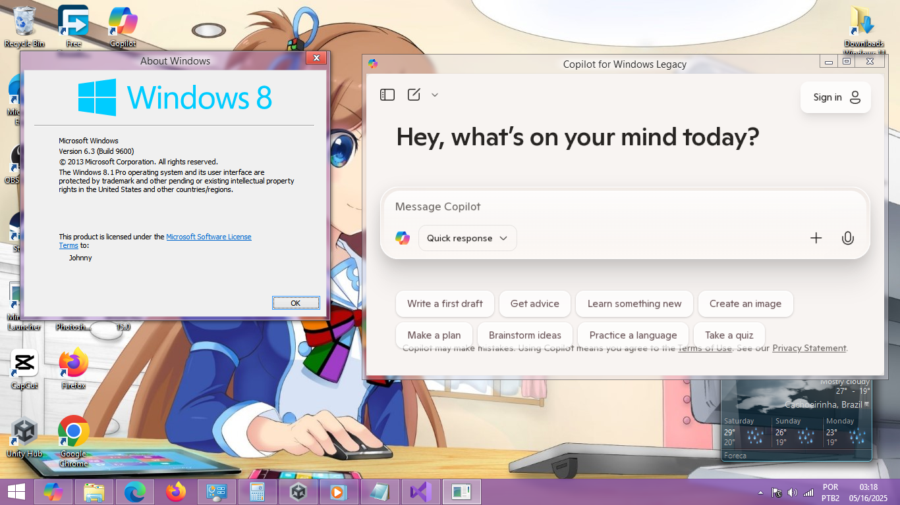

**Copilot for Windows Legacy** is designed to work on previous versions of Windows as a native app. It is based on CefSharp 109, the last version supported by legacy systems.

## Compilation Methods:

> Use Visual Studio 2019
> 
> Ensure the NuGet package CefSharp.WPF is installed in your VS
> 
> Compilation is simple and works for both 32-bit and 64-bit

## Questions & Answers:
**Q: Is this an official Microsoft product?**
A: Copilot itself is official, but the program is independently developed. However, all functions—such as account management—are handled through Microsoft’s website.

**Q: Is it compatible with Windows 10 and 11?**
A: Yes, but I don’t see much reason to install it since Windows already has built-in support.

**Q: Can I install it on Windows Vista or older?**
A: No, it runs on .NET 4.7, but it's not entirely impossible to make it work—at least on Vista. As for XP, I wouldn’t bet on it.

**Q: Can I modify the elements within the AI?**
A: Unfortunately, no. Those are managed by Microsoft’s website. However, I plan to completely recreate the program, so feel free to experiment. As you can see from the code, it's quite a simple program.

# *Screenshot:*

## Licences
**Visual Studio** → If you used the free Community edition, it has specific rules for commercial use.

**CefSharp** → Distributed under the BSD license, which allows usage and modifications.

**Microsoft Copilot** → Since it's owned by Microsoft, access to it may be subject to Microsoft's Copilot Terms of Use.
